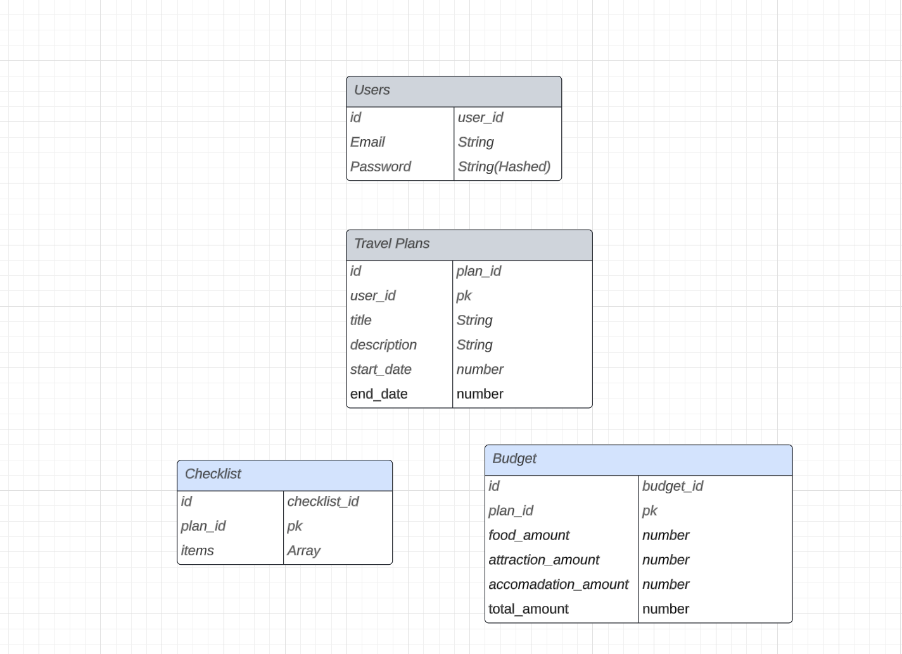

# Travel Planner App Backend
This backend service is the heart of our Travel Planner application, providing the necessary functionality to create, manage, and retrieve travel plans.

#### Trello: 
https://trello.com/b/HFDgCYOP/trip-advisor

## Routes
POST /auth/register: Register a new user. 
POST /auth/login: Authenticate a user and get an access token. 
GET /plans: Retrieve a list of travel plans. 
POST /plans: Create a new travel plan. 
GET /plans/:planId: Retrieve a specific travel plan. 
PUT /plans/:planId: Update a travel plan. 
DELETE /plans/:planId: Delete a travel plan. 

## Models

## Built Withmodel
-Node.js 
-NPM 
-MongoDB